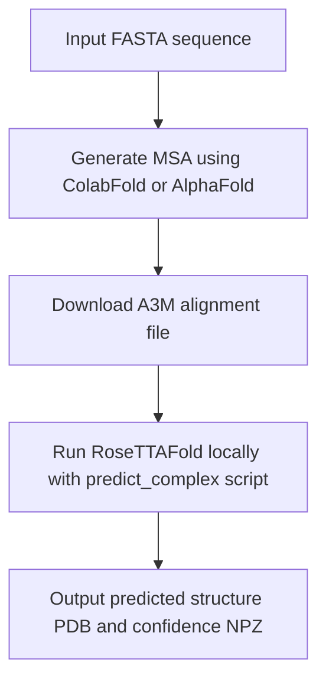

# SRX1 Protein Docking to TSA1/2 Paralogs
Protein docking simulation of SRX1 to TSA1/2 paralogs in S. cerevisiae using Colab Alphafold and RoseTTAFold deep learning. 

## 🧬 RoseTTAFold Local Prediction Workflow

